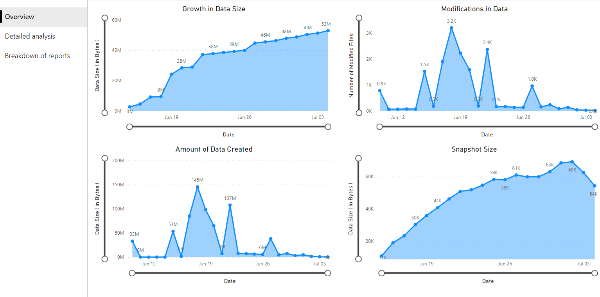
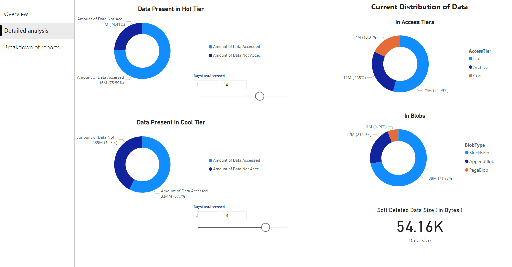
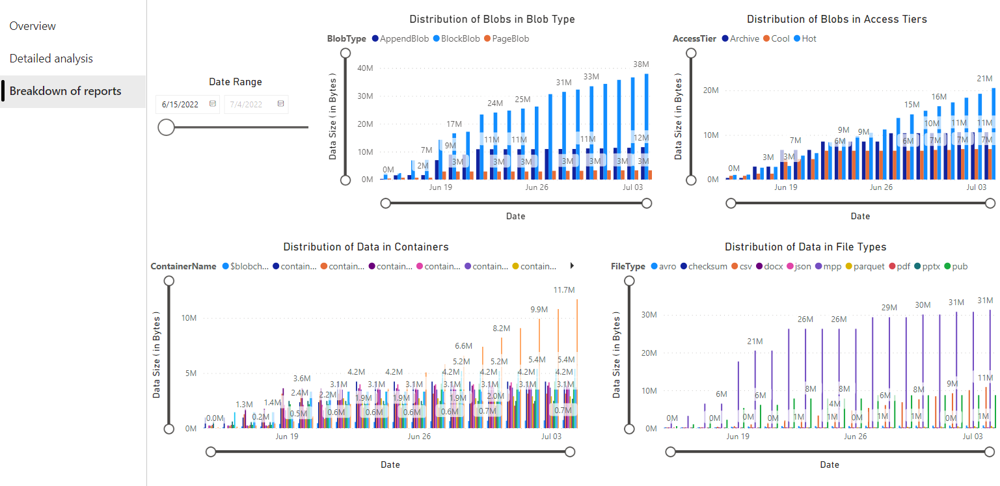
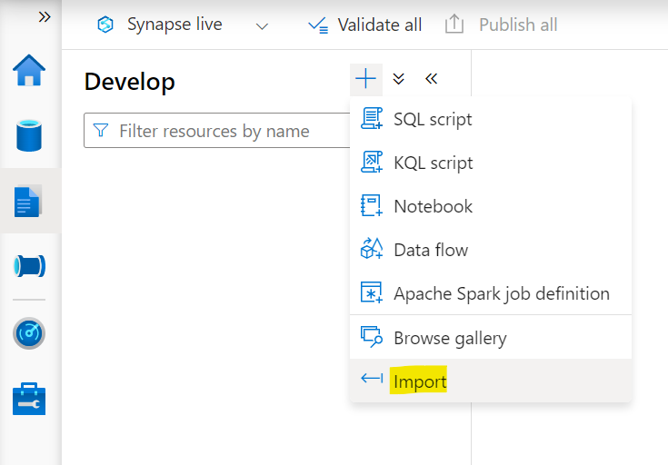
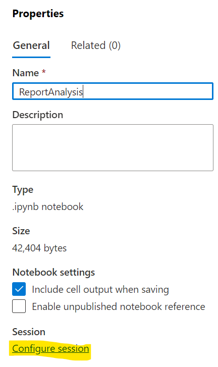
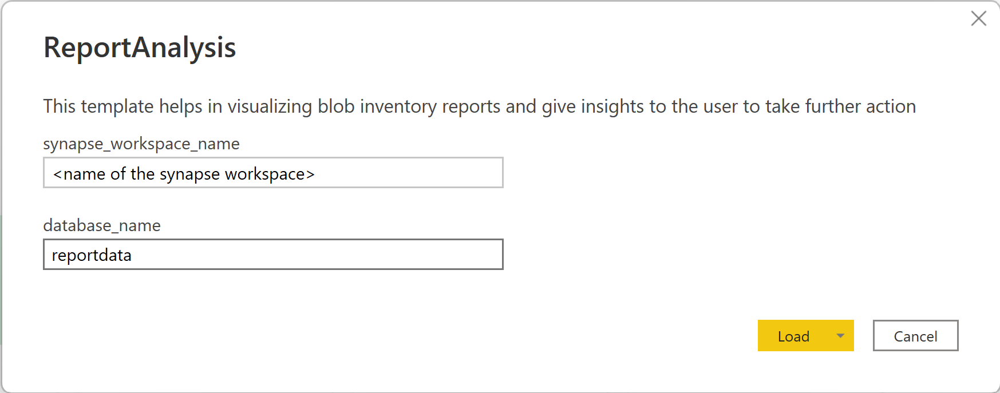

# Blob Inventory report analytics

The [Azure Storage blob inventory](https://docs.microsoft.com/azure/storage/blobs/blob-inventory) feature provides an overview of your containers, blobs, snapshots, and blob versions within a storage account. The inventory report can be used to understand various attributes of blobs and containers such as total data size, age, encryption status, immutability policy, legal hold and so on.  

Inventory provides information on Containers and blobs within the storage account. This project demonstrates how to bring up Inventory reports in Azure Synapse and run queries to derive insights. Additionally, the project also describes how to visualize the analytics data in Power BI. Such an analysis will be helpful in understanding the characteristics of Storage Accounts in terms of their usage, the data stored in them etc. Further, the information can be used to optimize for cost using Lifecycle policies.

## List of Insights

1. Overview
    1. Overall growth in data over time
    1. Amount of data added to the storage account over time
    1. Number of files modified
    1. Blob snapshot size [Blob snapshots - Azure Storage | Microsoft Docs](https://learn.microsoft.com/azure/storage/blobs/snapshots-overview)
1. Detailed analysis
    1. Data access patterns in different tiers of Storage (Hot, Cool, Archive)
    1. Distribution of data across tiers
    1. Distribution of data across blob types
1. Data profile
    1. Distribution of blob in blob types
    1. Distribution of data in containers
    1. Distribution of blobs in access tiers
    1. Distribution of data by file types

## Sample visualizations

## Steps for generating insights and visualizations

1. [Enable inventory reports](#1-enable-inventory-reports)
1. Create resources
    1. [Setup Azure Synapse workspace - via manual steps or via Arm templates provided](#2-set-up-azure-synapse-workspace-–-via-manual-steps-or-via-the-arm-templates)
    1. [Configure permissions to allow Azure Synapse to store files in a storage account](#3-configure-permissions-to-allow-azure-synapse-to-store-files-in-a-storage-account)
    1. [Provide the configuration file to read the blob inventory report files](#4-provide-the-configuration-file-to-read-the-blob-inventory-report-files)
1. [Import the PySpark notebook that has analytics queries](#5-import-the-pyspark-notebook-that-has-analytics-queries)
1. [Run the PySpark notebook](#6-run-the-pyspark-notebook)
1. [Visualize the results of the above queries in PowerBI reports](#7-visualizing-the-data)

### 1. Enable inventory reports
The first step is to enable blob inventory reports on your storage account. After the inventory reports are generated, please process to the next steps. You may have to wait upto 24 hours after enabling inventory reports for your first report to be generated.

### 2. Set up Azure Synapse workspace – via manual steps or via the ARM templates

An Azyre Synapse workspace can be created either via manual steps or via the ARM templates provided.

#### Manual steps

1. Create an Azure Synapse workspace
    1. [Create an Azure Synapse workspace](https://learn.microsoft.com/azure/synapse-analytics/get-started-create-workspace) where you will execute a PySpark notebook to analyze the inventory report files.
    1. Grant Storage Blob Data Contributor access to Synapse workspace’s Managed Service Identity (MSI).
1. [Create Apache Spark pool](https://learn.microsoft.com/azure/synapse-analytics/get-started-analyze-spark) in Synapse workspace created above. This Apache Spark pool will be used to execute PySpark notebook that will process the reports generated by Azure Blob Storage Inventory.

#### Via ARM templates

Deploy [SynapseArmTemplate.json](https://github.com/microsoft/Blob-Inventory-Report-Analytics/blob/main/src/arm-templates/SynapseArmTemplate.json) from Azure portal using [Deploy a custom template](https://learn.microsoft.comazure/azure-resource-manager/templates/quickstart-create-templates-use-the-portal).

### 3. Configure permissions to allow Azure Synapse to store files in a storage account

Grant yourself and other users who will require access to data visualization the following roles:
1. [Storage Blob Data Contributor role on Storage account used while creating the Synapse workspace](https://learn.microsoft.com/azure/synapse-analytics/get-started-add-admin#azure-rbac-role-assignments-on-the-workspaces-primary-storage-account)
1. [Contributor role on Synapse workspace](https://learn.microsoft.com/azure/synapse-analytics/get-started-add-admin#azure-rbac-owner-role-for-the-workspace)
1. [Synapse Administrator role on Synapse studio](https://learn.microsoft.com/en-us/azure/synapse-analytics/get-started-add-admin#synapse-rbac-synapse-administrator-role-for-the-workspace)

Please note that this step needs to be repeated for each user that will run the PySpark notebook used later in this documentation and also for users who will visualize the data using PowerBI

### 4. Provide the configuration file to read the Blob Inventory report files

Download [BlobInventoryStorageAccountConfiguration.json](https://github.com/microsoft/Blob-Inventory-Report-Analytics/blob/main/src/BlobInventoryStorageAccountConfiguration.json) and update the placeholders inside it in following manner:
1. *storageAccountName*: Name of the storage account for which inventory has been run
1. *destinationContainer*: Name of the container where inventory reports are stored
1. *blobInventoryRuleName*: Name of the inventory rule whose results should be analyzed
1. *accessKey*: [Access keys for the storage account](https://learn.microsoft.com/azure/storage/common/storage-account-keys-manage?tabs=azure-portal#view-account-access-keys) in which inventory reports are stored.

After updating the above placeholders, upload the configuration file in the storage container used while creating Synapse workspace.

### 5. Import the PySpark Notebook that has analytics queries

After you create the above resources and assign the permissions, perform the following steps:
1. Download [ReportAnalysis.ipynb](https://github.com/microsoft/Blob-Inventory-Report-Analytics/blob/main/src/ReportAnalysis.ipynb)
1. Navigate to [https://web.azuresynapse.net](https://web.azuresynapse.net)
1. Select the **Develop** tab on the left edge
1. Select the large plus sign (+) to add an item
1. Select Import
1. This will open a select file dialog. Upload the [ReportAnalysis.ipynb](https://github.com/microsoft/Blob-Inventory-Report-Analytics/blob/main/src/ReportAnalysis.ipynb) downloaded above
    
1. This will open a Properties tab on the right. Select **Configure Session**
    
1. Select the Apache Spark pool created earlier in the **Attach to** dropdown and click **Apply**
1. In the first cell of Python notebook, update the value of **storage_account** and **container_name** variables to the names of the storage account and container specified while creating the synapse workspace
1. Click on "Publish" button in order to save the notebook in Azure Synapse studio and to avoid uploading it next time you run the notebook

### 6. Run the PySpark notebook

1. In the PySpark notebook imported above and click on **Run all**
1. It will take 3-4 minutes to start the Spark session and another couple of minutes to process the Inventory reports
1. Do remember to publish the notebook again if you made any changes in the notebook while running it

Please note that the first run could take a while if there are a lot of Inventory reports to process. Subsequent runs will only process the new inventory reports created since the last run

### 7. Visualizing the data

Open [ReportAnalysis.pbit](https://github.com/microsoft/Blob-Inventory-Report-Analytics/blob/main/src/ReportAnalysis.ipynb) file using [PowerBI desktop application](https://powerbi.microsoft.com/downloads/). Please note that this file may not render correctly with the web version of PowerBI application and hence we recommend that you use the Desktop version of PowerBI. When the report is opened, a popup will open like the one shown below. In this popup, enter the name of the Synapse workspace in **synapse_workspace_name** and **database_name** as reportdata.

## Common errors

If you see any error/warning in opening the PowerBI report, including but not limited to:
1. The key did not match any row in the table
1. Access to the resource is forbidden

The above errors are generic errors displayed by PowerBI. Please ensure that you have provided the input correctly to PowerBI template. Additionally, the following actions can be taken to handle the most frequently occurring errors:
1. *Missing permissions*: Please make sure the user logged into PowerBI has the required access mentioned in [Configure permissions to allow Azure Synapse to store files in a Storage Account](#3-configure-permissions-to-allow-azure-synapse-to-store-files-in-a-storage-account) step.
1. *Inventory reports not yet generated*: Verify that the inventory run has succeeded at least once for the rule provided to PySpark notebook. Also verify the destination container provided to the PySpark notebook. An alternate way to also verify this is by going to Azure synapse studio in which you ran the PySpark notebook and ensure that a database named "reportdata" is present in Data -> Workspace -> Lake Database.

## Next steps

* [Use Azure Storage blob inventory to manage blob data](https://learn.microsoft.com/azure/storage/blobs/blob-inventory)
* [Optimize costs by automatically managing the data lifecycle](https://learn.microsoft.com/azure/storage/blobs/lifecycle-management-overview)
* [Created data trigger to automatically process inventory reports](https://learn.microsoft.com/azure/data-factory/how-to-create-schedule-trigger?tabs=data-factory)

## Contributing

This project welcomes contributions and suggestions.  Most contributions require you to agree to a
Contributor License Agreement (CLA) declaring that you have the right to, and actually do, grant us
the rights to use your contribution. For details, visit https://cla.opensource.microsoft.com.

When you submit a pull request, a CLA bot will automatically determine whether you need to provide
a CLA and decorate the PR appropriately (e.g., status check, comment). Simply follow the instructions
provided by the bot. You will only need to do this once across all repos using our CLA.

This project has adopted the [Microsoft Open Source Code of Conduct](https://opensource.microsoft.com/codeofconduct/).
For more information see the [Code of Conduct FAQ](https://opensource.microsoft.com/codeofconduct/faq/) or
contact [opencode@microsoft.com](mailto:opencode@microsoft.com) with any additional questions or comments.

## Trademarks

This project may contain trademarks or logos for projects, products, or services. Authorized use of Microsoft 
trademarks or logos is subject to and must follow 
[Microsoft's Trademark & Brand Guidelines](https://www.microsoft.com/legal/intellectualproperty/trademarks/usage/general).
Use of Microsoft trademarks or logos in modified versions of this project must not cause confusion or imply Microsoft sponsorship.
Any use of third-party trademarks or logos are subject to those third-party's policies.
